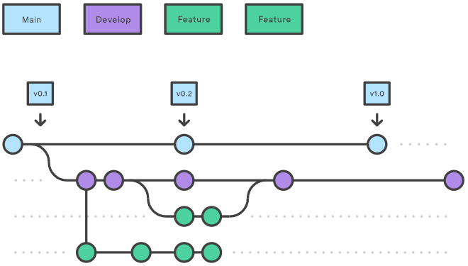
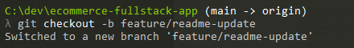
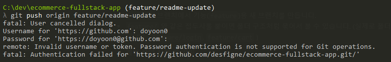
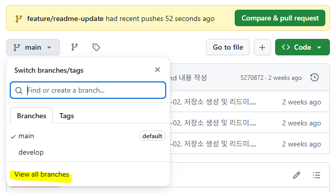
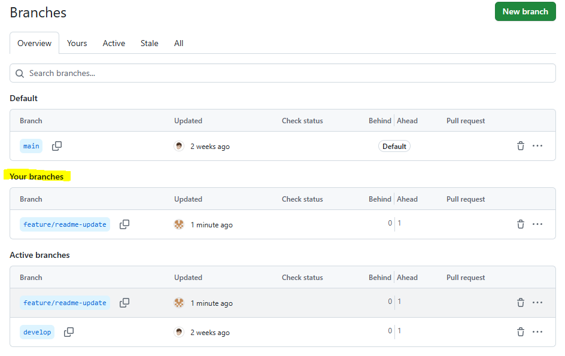
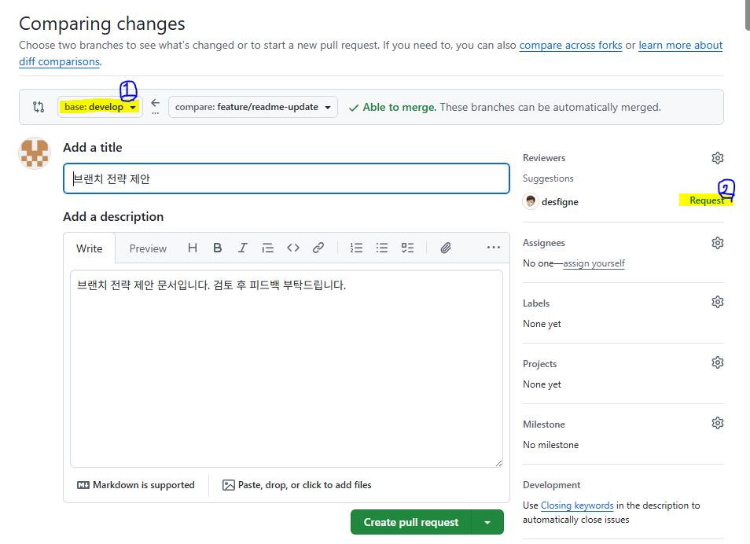

# Git Branch 전략


## Develop 브랜치와 Main 브랜치



하나의 main 브랜치 대신 두 개의 브랜치를 사용하여 프로젝트 이력을 관리합니다.

- **main 브랜치**는 항상 깨끗하고 배포 가능한 상태를 유지합니다.
- **develop 브랜치**는 각자 기능(`feature`) 개발 후 통합 테스트를 위한 브랜치입니다.


## develop 브랜치 생성 방법

기본 main 브랜치에 develop 브랜치를 추가하는 첫 단계는,

한 명의 개발자가 로컬에서 빈 develop 브랜치를 생성하고 원격 저장소에 푸시하는 것입니다.

```bash
git branch develop #로컬에 develop 브랜치 생성
git push -u origin develop #원격 저장소에 푸시하며, main 브랜치와 연결(upstream)
```

## Feature 브랜치 생성 및 작업 단계

1. **최신 develop 브랜치 가져오기 (작업 전 필수 단계 : `feature` 생성 전에 꼭 해주기)**

```bash
git checkout develop
git pull origin develop
```

- 로컬에 `develop` 브랜치 생성하여 이동 후 원격 저장소 `origin develop` 의 최신 내용을 가져옵니다.

1. **feature 브랜치 생성**



```bash
git checkout -b feature/기능명
```

- `develop` 브랜치에서 기능(`feature`)용 새 브랜치를 만듭니다.
- `feature/` 와 같은 접두사를 붙이면 폴더 구조처럼 묶어서 볼 수 있습니다. (실제로 폴더가 생성되는 것은 아님)  (예 : `feature/login`, `feature/cart` )

1. **개발 작업 진행 및 커밋**
- 개인이 생성한 로컬 `feature`에서 기능 작업 후 커밋합니다.

1. **원격 저장소에 feature 브랜치 푸시**

```bash
git push -u origin feature/기능명
```

- 작업한 feature 브랜치를 원격 저장소에 올리고, 업스트림 브랜치로 설정합니다.





1. **추가 작업 시 최신 develop 내용 반영**

```bash
git checkout develop            #내 로컬 develop 브랜치에
git pull origin develop         #원격 develop 브랜치를 끌어오고
git checkout feature/기능명     #작업한 feature 브랜치로 이동한 후
git merge develop               #develop 분기와 merge
```

- 개발 도중 develop 브랜치가 업데이트 되었을 경우, 최신 내용을 feature 브랜치에 병합하여 충돌을 최소화합니다.
- `merge` 작업 중 충돌이 발생하였을 경우, 코드를 수정하고 add → commit → push 진행합니다.

1. **작업 완료 후 develop으로 Pull Request 생성**
- GitHub 에서 `feature` 브랜치를 `develop`으로 병합하는 `Pull Request`를 생성합니다.


---

### `main - develop - feature` 구조를 추천드리는 이유 :

- Git Flow는 `release`, `hotfix` 브랜치가 추가되어서 소규모 프로젝트에서 복잡하고 관리가 어려움.
- GitHub Flow는 `main` 과 `feature` 브랜치만 있어 `main` 브랜치에 직접 병합되면서 안정성 문제 발생.
<br/><br/>


# Git 명령어 모음

### Viewing the Staged/Unstaged changes

```bash
git status #full status
git diff #changes in working directory
git diff --staged #changes in staging area
git diff --cached #same as --staged
```

### Visual Diff Tool

**Open .gitconfig and add below** 

```bash
[diff]
    tool = vscode
[difftool "vscode"]
    cmd = code --wait --diff $LOCAL $REMOTE
```

**Run Git Diff tool**

```bash
git difftool
```

## Merge

```bash
git merge featureA #merges featureA branch into the current one
git merge --squash featureA #suqash merge, only one commit
git merge --no-ff featureA #creates a merge commit
git merge --continue 
git merge --abort
git mergetool #opens merge tool 
```

- 주의: `squash` 는 모든 커밋 이력이 하나의 커밋으로 합쳐지고 사라진다. [참고](https://jangjjolkit.tistory.com/49)

**Merge tool Config** 

```bash
[merge]
    tool = vscode
[mergetool]
	keepBackup = false
[mergetool "vscode"]
    cmd = code --wait $MERGED
[mergetool "p4merge"]
    path = "/Applications/p4merge.app/Contents/MacOS/p4merge"
```

## Rebasing

```bash
git rebase master #rebase current branch onto the master
git rebase --onto master service ui #take commits of the ui branch forked from the service branch and move them to master
```

## Cherry picking

```bash
git cherry-pick hash #applies the given commit 
```


## Local Changes

**Unstaging a staged file**

```bash
git reset
git reset HEAD file.txt
```

**Unmodifying a modified file**

```bash
git checkout -- file.txt
```

**Discarding local changes**

```bash
git restore --staged file.txt #unstaging a staged file
git restore file.txt #unmodifying a modified file
git restore . #unmodifying all modified files in the directory
git clean -fd #removes all untracked files
```

**Restoring file from certain commit**

```bash
git restore --source=hash file.txt
git restore --source=HEAD~2 file.txt
```

## Reset

```bash
git reset --soft HEAD #removes the commit and keep changes at staging area
git reset --mixed HEAD #removes the commit and keep changes at working directory
git reset --hard HEAD #removes the commit and don't keep the code
```

## Revert

```bash
git revert hash #reverts the given commit
git revert HEAD~1 
gut revert --no-commit hash #reverts the given commit without revert commit
```

---

참고 문헌 :

[https://www.atlassian.com/git/tutorials/comparing-workflows/gitflow-workflow](https://www.atlassian.com/git/tutorials/comparing-workflows/gitflow-workflow)

[https://jangjjolkit.tistory.com/49](https://jangjjolkit.tistory.com/49)